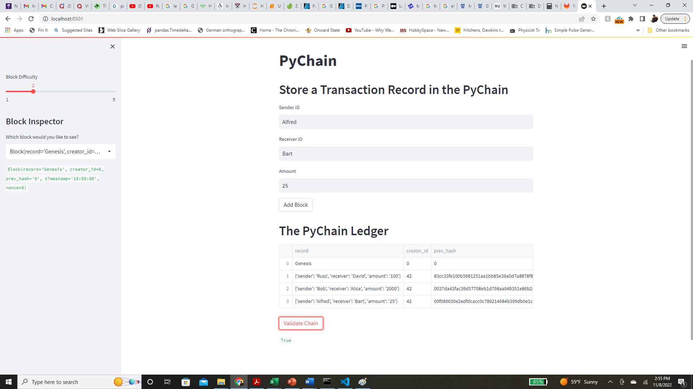

# Challenge18

This is a program creates a basic blockchain for use with streamlit web application.

---

## Technologies

This project leverages python 3.7 with the following packages:


* [pandas](https://github.com/pandas-dev/pandas) - Flexible and powerful data analysis / manipulation library for Python, providing labeled data structures similar to R data.frame objects, statistical functions, and much more

* [pathlib](https://github.com/budlight/pathlib) - Specifies a path

* [numpy](https://github.com/numpy/numpy) - Fundamental package for scientific computing for Python.

* [streamlit](https://github.com/streamlit) - The fastest way to build custom ML tools


---

## Installation Guide

Before running the application first install the following dependencies.

```python
conda install -c conda-forge numpy
conda install -c conda-forge pandas
pip install streamlit
```

---

## Usage

This application runs a fixed program for analysis.  The application can be manipulated by interacting with the generated plots to look through the different results.

## Contributors

Brought to you by Russell Moore & Columbia Fintech Bootcamp.

---
## License

Open Source

## Version

First Version and only version as everything ran smoothly.

## Evaluation Report

 The blockchain ran well and it recorded transactions as well as validated the blocks.



